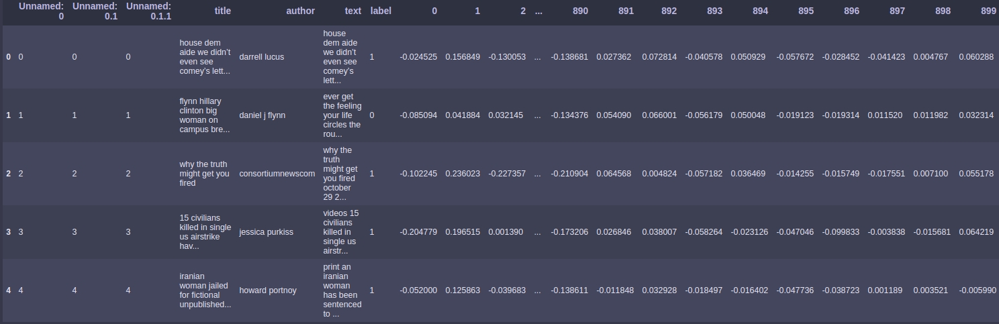

## Fake news predictions with Keras

The dataset "Fake News" of the fake news was taken from the Kaggle competition https://www.kaggle.com/c/fake-news. File contains the title of article, it's author, the text and the labels if the article is true ('0') or potentially fake('1').
</br>In this repository there will be shown the examples of text vectorization and training the model using the text data.

### Fake news dataset vectorization

This example of text vectorization given in the file 'fake_news_vectorization.py' requires the spaCy python package and the English multi-task CNN provided by it, which can be obtained with the following terminal commands:

```
pip install spacy
python -m spacy download en_core_web_md
```

The dataset contains three columns with text data which should be converted to a numerical data for the further training. In the code for each column and each row is converted to 300 vectors and later adds these vectors to new 300 columns. The vectorized dataset which will be saved in a file contains in total 906 columns including the old ones.
</br>
</br> The example of the first 5 rows:



### Fake news dataset training

The following code 'fake_news_training.py' requires Numpy, Pandas and Keras packages.
</br>This example shows the simple keras model for the vectorized dataset predictions. The dataset is automatically separated on the training and validation parts (33% of the dataset). The following output shows that the result for testing is around 0.97, which means that 97% of the predictions were correct. The binary output is approximately evenly distributed, which means that simple accuracy can precisely describe the performance of the model.
</br>
</br>The output of the last 5 epochs:
```
Train on 13713 samples, validate on 4571 samples
Epoch 10/15
 - 2s - loss: 0.0057 - acc: 0.9849 - val_loss: 0.0078 - val_acc: 0.9781
Epoch 11/15
 - 2s - loss: 0.0052 - acc: 0.9861 - val_loss: 0.0073 - val_acc: 0.9799
Epoch 12/15
 - 2s - loss: 0.0056 - acc: 0.9852 - val_loss: 0.0116 - val_acc: 0.9683
Epoch 13/15
 - 1s - loss: 0.0050 - acc: 0.9864 - val_loss: 0.0064 - val_acc: 0.9825
Epoch 14/15
 - 1s - loss: 0.0042 - acc: 0.9889 - val_loss: 0.0077 - val_acc: 0.9797
Epoch 15/15
 - 1s - loss: 0.0045 - acc: 0.9879 - val_loss: 0.0065 - val_acc: 0.9829
```
